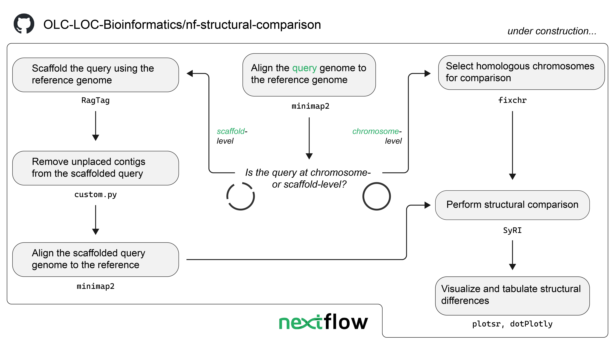

# nf-structural-comparison

*This workflow is currently under development and has not yet been validated.*

A Nextflow DSL2 workflow for the structural comparison of bacterial genomic assemblies.
This workflow uses [SyRI](https://github.com/schneebergerlab/syri) to compare alignments between genomic assemblies to identify structural differences and SNVs.

## Overview

